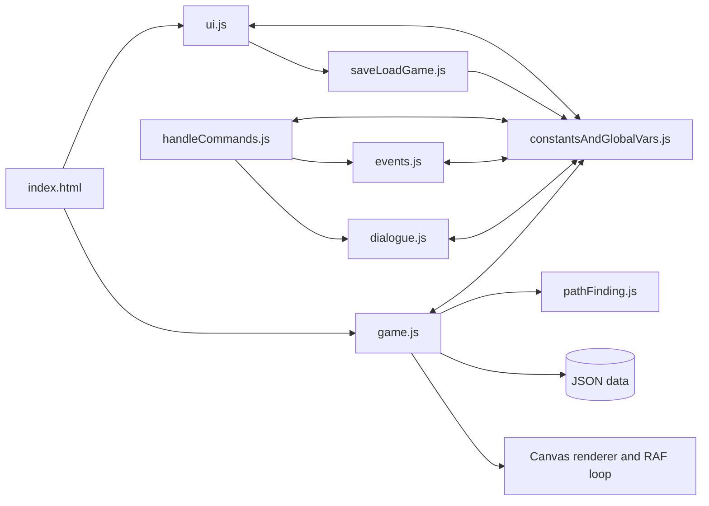

# Code and content audit

## Executive assessment

The project is a genuine playable prototype with unusually substantial authored content. Its biggest asset is not the current implementation; it is the combination of humour, locations, character art, puzzle thinking, and a working interaction loop. Its biggest constraint is that nearly every subsystem shares mutable global state. Story flow, rendering, movement, UI, dialogue, and content mutation are tightly interwoven, so small changes can create distant regressions.

The right strategy is an incremental extraction around the existing game, not a rewrite. First make state observable and testable, then separate pure rules from canvas/DOM effects, validate content, fix persistence, and modernise presentation on top of stable behaviour.

Foundation update (2026-09-13): a versioned serialisable state factory/store now provides the canonical lifecycle snapshot behind the legacy accessors. New sessions replace state, own and dispose their animation frame and session listeners, await validated data/localisation/image readiness, and fail into a visible alert. The remaining legacy modules still require the staged domain extraction described below.

## Repository snapshot

- Runtime: browser ES modules, HTML canvas, CSS, Bootstrap/jQuery/Popper and LZString from CDNs.
- Server: local Express static server, now available through `npm start`.
- Automated browser testing: Playwright with Chromium, now scaffolded by functional area.
- Content: JSON navigation, grids, objects, NPCs, localisation, and dialogue.
- World model: 19 navigation records, 41 objects, 10 NPCs, 19 room-grid variants, and 7 foreground room layers observed in the audit.
- Locales: English, Spanish, German, Italian, and French key sets are present and complete for the inspected localisation/dialogue records.
- Assets inspected: 253 PNG, 64 JPG, 5 PSD, 4 GIF, plus design documents and diagrams in the available project resources.
- Core code is roughly ten thousand physical lines, led by `game.js`, `ui.js`, `constantsAndGlobalVars.js`, `handleCommands.js`, and `events.js`.
- Repository history is currently dominated by binary material: the Git pack was approximately 906 MiB and included two tracked build ZIPs of about 49 MiB each.

Counts describe the audited snapshot and should be regenerated after large content changes.

## Runtime architecture



The diagram is simplified: several modules import one another directly, including circular relationships. `constantsAndGlobalVars.js` is effectively a service locator and mutable database with hundreds of accessors. This lets a small prototype move quickly, but makes state ownership, teardown, and isolated testing unclear.

## Startup and main loop

1. The HTML shell loads ES modules and remote UI/compression libraries.
2. Menu localisation is fetched and rendered.
3. New Game loads room/navigation/object/NPC/dialogue JSON, sets the opening room (`libraryFoyer`) and player position (grid coordinate 10,57), prepares UI/canvas listeners, and enters a `requestAnimationFrame` loop.
4. Each frame advances movement/animation, draws background and entities, and updates debug values.
5. Mouse position is translated to a grid cell. The selected verb plus hovered object/NPC/inventory item builds the interaction sentence.

There is no explicit application lifecycle with `boot`, `startSession`, `disposeSession`, and `restoreSession`; consequently repeated starts can retain state or duplicate listeners.

## Click-zone and pathfinding model

The visible canvas is mapped to an 80 × 60 logical grid. Pointer coordinates are made canvas-relative, divided by cell dimensions, and floored to select a cell.

| Cell prefix | Meaning |
| --- | --- |
| `w...` | Walkable cell/cost variant |
| `n` | Non-walkable |
| `e<number>` | Exit/hotspot mapped to a room navigation exit |
| `o<objectId>` | World object interaction footprint |
| `c<npcId>` | Character interaction footprint |

Objects and NPCs overlay rectangular footprints onto the room grid from their data dimensions. Hover identification drives command text and click handling. A* pathfinding uses grid costs and a Manhattan-style heuristic, with logic for nearby walkable fallbacks. Exits may move to target-room initial/final coordinates.

Strengths:

- A fixed logical grid decouples authored walkability from image pixels.
- Object/NPC footprints allow visual assets and interactions to be data-driven.
- Nearby-walkable fallback can keep interactions from failing when the hotspot itself is blocked.

Weaknesses:

- Rectangle-only zones are imprecise for irregular art and promote accidental overlaps.
- Grid codes mix navigation, identity, and cost in compact strings without a schema validator.
- There is no visible hotspot authoring/validation tool, overlap report, or minimum-target-size rule.
- Resizing and CSS scaling must remain perfectly consistent with canvas coordinate mapping.
- The current player can still be asked to infer invisible boundaries; an optional hotspot reveal mode is needed.

Recommended evolution: retain the grid for walking, introduce named polygon/rectangle hotspots in room data, associate each with an interaction anchor and accessible label, and add a debug overlay for walkability, footprints, anchors, exits, and computed paths.

## Interaction and verbs

Nine classic verbs are represented: Look, Pick Up, Use, Open, Close, Push, Pull, Talk To, and Give. Two-stage verbs combine inventory/world targets. This preserves a deliberate old-school vocabulary and supports joke responses.

At present, the command layer maps localised display strings back to semantic IDs. Some dialogue flow is encoded in trailing spaces, exclamation marks, and compact order strings. This is brittle: translators can accidentally change program flow and duplicate/overlapping labels can resolve incorrectly. Commands should be structured objects such as `{ verbId, primaryTargetId, secondaryTargetId }`; dialogue should use explicit node and action fields.

## Dialogue and narrative state

The dialogue engine can display sequenced speech, options, responses, and event consequences. The inspected dialogue-flow diagram matches the code's broad cycle: enter a phase, render lines, optionally show choices, process a response/event, advance or reset the phase, and tidy UI state.

The engine is expressive but its representation obscures intent. Replace encoded control strings with a documented graph schema:

```json
{
  "id": "librarian.ask_for_help",
  "speaker": "librarian",
  "textKey": "dialogue.librarian.ask_for_help",
  "choices": [{ "textKey": "...", "next": "librarian.riddle" }],
  "actions": [{ "type": "setFlag", "id": "librarianRiddleKnown", "value": true }]
}
```

This makes choice reachability, missing translations, and quest effects statically testable.

## Content and data integrity

Positive findings:

- All inspected JSON parses.
- All room grids inspected are 80 × 60.
- Referenced object and NPC sprites were found.
- The five-language key sets inspected are structurally complete.

Material gaps:

- `debugRoom` has no usable matching grid/data set and points to nonexistent `libraryFoyerDebug`.
- `map` is referenced by navigation but its background and grid are absent.
- Debug object/NPC JSON paths referenced by code are absent.
- The current runtime topology differs from the supplied world map. The map contains an Embassy, while the runtime adds sewer/kitchen and uses separate barn/house interiors. This may reflect later design evolution, but there is no canonical version declaration.
- Market Street currently exposes five connections; the scene brief asked for four. The difference needs an explicit design decision rather than accidental drift.

Add a content validator that checks IDs, files, grid dimensions/codes, reciprocal exits, spawn points, hotspot bounds, dialogue links, item references, localisation keys, and puzzle reachability before the game starts or in CI.

## Save and load

The menu and compression/export UI imply a real save system, but the current state capture/restore only persists language. Player position, room, inventory, object/NPC mutations, puzzle flags, dialogue progress, exits, and active animations are lost. This is a blocker for a full chapter.

Use a versioned plain state object, validate it before applying, migrate older schemas, persist locally for Resume, and support explicit export/import. Save only stable facts; derive render caches and transient animations after load.

## Localisation

Five locales are a strong foundation. However, using `eval` for expressions from localisation data is a security and maintenance hazard and prevents a strict Content Security Policy. Replace it with named interpolation tokens resolved from a controlled dictionary. Add layout tests for longest strings, diacritics, missing keys, and locale switching in the middle of dialogue.

## Rendering, performance, and assets

The world renderer handles backgrounds, foreground layers, sprites, movement frames, and transitions. Risks include unawaited preloading, very large source images decoded at runtime, per-frame debug work/logging, inconsistent dimensions, and no declared asset budget.

Examples from visual and metadata inspection:

- Standard backgrounds are often 832 × 448, but audited sources also include 1530 × 765, 1000 × 581, 3329 × 1801, 1366 × 622, 800 × 436, and 800 × 600.
- Player still images mix 800 × 1500 and 200 × 375 source sizes for the same effective aspect/pose family.
- NPC images range from small legacy sprites to multi-megabyte, highly rendered caricatures.
- Several assets are byte-identical duplicates, including some player still/move frames, inventory/world items, and blank placeholders.
- A bridge-half-complete foreground is background-sized and unusually heavy relative to other sparse overlays.

Create a manifest and build-time pipeline that enforces canonical scene dimensions, character world scale, alpha/crop rules, WebP/AVIF or optimised PNG outputs, maximum decoded size, and intentional duplicate aliases.

## UI, responsiveness, and accessibility

The layout communicates the classic genre immediately, but it is heavily fixed-positioned and hard-coded. Most interaction exists only inside canvas pixels or clickable `div`/`span` elements. Keyboard navigation, screen-reader semantics, focus management, live dialogue announcements, touch sizing, reflow, reduced motion, and high-contrast treatment are absent or incomplete.

Modernisation should not simply add gloss. It should establish a scalable stage, semantic interaction mirror, consistent panels, contextual feedback, responsive layout modes, and accessible alternatives while preserving the verb-table character.

## Dependencies and delivery

- Remote CDN dependencies create offline, CSP, version-drift, and desktop-packaging risks and have no visible integrity strategy.
- The dependency audit after installation reported 34 known issues: 4 low, 3 moderate, 25 high, and 2 critical, largely in the existing packaging/server chain. Upgrade deliberately; do not apply an unreviewed force fix.
- Electron and electron-builder sit in runtime dependencies even though the root entry now serves the browser and a separate generated desktop tree exists. Choose and document one packaging architecture.
- Generated build archives were tracked despite being reproducible and large. `.gitignore` now excludes them; existing tracked archives should be removed from the index while retained locally if Leigh wants them.

## Maintainability priorities

1. Make lifecycle and state deterministic.
2. Add content validation and stable semantic schemas.
3. Complete save/load before expanding the chapter.
4. Extract commands, dialogue, puzzles, and navigation as pure/testable rules.
5. Put rendering and DOM behind adapters.
6. Establish asset/art standards and optimise delivery.
7. Modernise UI/accessibility on verified behaviour.

Detailed execution appears in the refactor, feature, testing, debug-control, and master-checklist documents.
