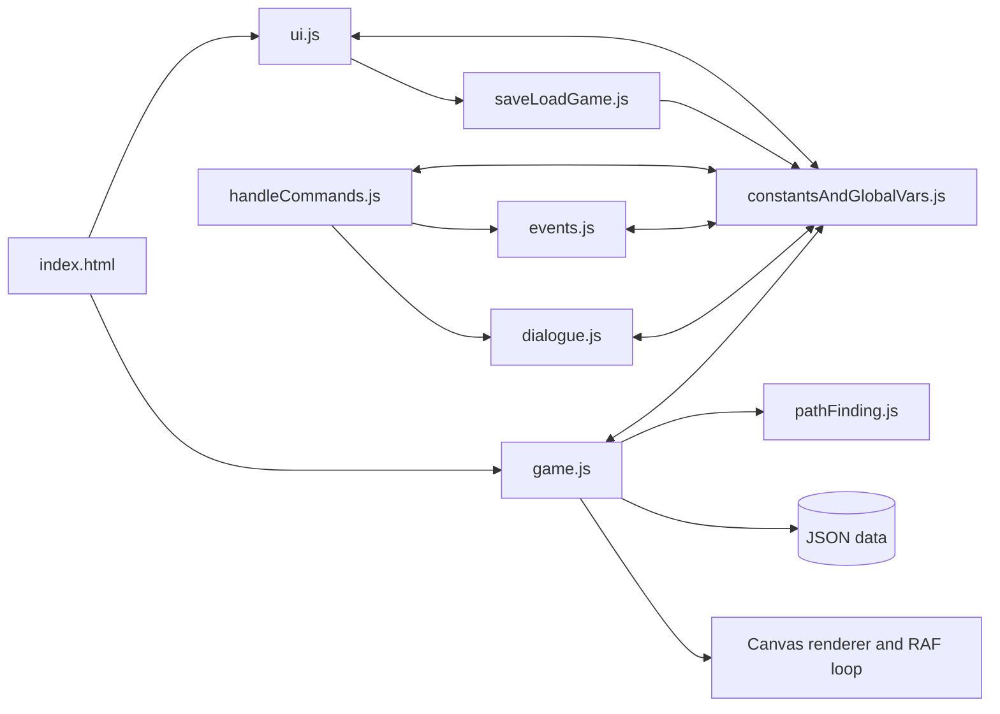

# Code and content audit

This is the open half of the audit: what is still true about the code and content, and what still needs work. Findings that have been closed, and the reasoning that closed them, are in [archive/code-audit-resolved.md](archive/code-audit-resolved.md).

## Executive assessment

The project is a genuine playable prototype with unusually substantial authored content. Its biggest asset is not the current implementation; it is the combination of humour, locations, character art, puzzle thinking, and a working interaction loop. Its biggest remaining constraint is that several legacy subsystems still share mutable global state, so small changes can create distant regressions.

The strategy remains incremental extraction around the existing game, not a rewrite. The lifecycle, content contract, domain rules, debug reachability, save format, puzzle graph, responsive UI, and accessible input are done; what is left is art/audio consistency, delivery, and retiring the legacy bridge.

## Repository snapshot

- Runtime: browser ES modules, HTML canvas, CSS, and LZString from a CDN.
- Server: local Express static server through `npm start`, plus a debug server for the test harness.
- Automated testing: 62 Node tests and 69 Playwright browser journeys by functional area.
- Content: 18 navigation records, 42 objects, 10 NPCs, and 7 foreground room layers, as validated by `npm run validate:content`.
- Locales: English, Spanish, German, Italian, and French key sets are present and complete.

## Runtime architecture

The diagram is simplified: several legacy modules import one another directly, including circular relationships. `constantsAndGlobalVars.js` is still effectively a service locator and mutable database with hundreds of accessors. The extracted `src/` graph is cycle-free and boundary-checked, but the legacy half is not, which is BUG-021 and Phase 6 of the refactor plan.

## Click-zone and pathfinding model

The visible canvas is mapped to an 80 × 60 logical grid. Pointer coordinates are made canvas-relative, divided by cell dimensions, and floored to select a cell.

| Cell prefix | Meaning |
| --- | --- |
| `w...` | Walkable cell/cost variant |
| `n` | Non-walkable |
| `e<number>` | Exit/hotspot mapped to a room navigation exit |
| `o<objectId>` | World object interaction footprint |
| `c<npcId>` | Character interaction footprint |

Objects and NPCs overlay rectangular footprints onto the room grid from their data dimensions. A* pathfinding uses grid costs and a Manhattan-style heuristic, with nearby-walkable fallbacks.

Strengths: a fixed logical grid decouples authored walkability from image pixels; footprints keep interactions data-driven; the fallback keeps interactions from failing when the hotspot itself is blocked.

Remaining evolution: the semantic mirror currently projects rectangles from composed runtime cells. Irregular authored polygons can be introduced later where the art needs more precision; the walk grid remains independent.

## Dialogue and narrative state

The librarian tutorial runs on an explicit graph: stable nodes, choices, links, consequence IDs, and a recorded quest phase, content-validated and traversed in all five locales in the browser.

Every other conversation is still on the legacy representation, where control flow is encoded in punctuation and spacing — a trailing single space advances the quest phase, two spaces push an event, `!!!` exits early — and the speaker order is a compact digit string. That is BUG-011, and it is the root of two further limits: a conversation cannot be rewound for testing (BUG-031), and a save taken mid-conversation deliberately resumes in the room rather than in the conversation.

## Content and data integrity

All shipped JSON parses, all room grids are 80 × 60, referenced sprites resolve, and the five-language key sets are structurally complete. A content validator checks IDs, files, grid dimensions/codes, reciprocal exits, spawn points, hotspot bounds, dialogue links, item references, localisation keys, and puzzle reachability. It runs as `npm run validate:content`, in CI, and at startup, where invalid shipped content fails into the visible fatal alert.

The one known authoring gap is the rigging chain's pulley, which has no source in the world (BUG-035).

## Save and load

The contract is in [save-format.md](save-format.md). Two limits are recorded rather than hidden: the compact export string still uses the CDN-hosted LZString (BUG-013), though import also accepts plain JSON; and a save taken mid-conversation resumes in the room, which is a consequence of BUG-011 rather than a save defect.

## Localisation

Five locales are a strong foundation, and translated wording no longer selects behaviour. Long-text layout is covered across all five locales; mid-dialogue switching under a strict CSP remains later security coverage.

## Rendering, performance, and assets

The world renderer handles backgrounds, foreground layers, sprites, movement frames, and transitions. Risks that remain: very large source images decoded at runtime, inconsistent dimensions, and no declared asset budget. Console logging in the movement, placement, and transition paths is still noisy in production (BUG-016).

Examples from visual and metadata inspection:

- Standard backgrounds are often 832 × 448, but audited sources also include 1530 × 765, 1000 × 581, 3329 × 1801, 1366 × 622, 800 × 436, and 800 × 600.
- Player still images mix 800 × 1500 and 200 × 375 source sizes for the same effective aspect/pose family.
- NPC images range from small legacy sprites to multi-megabyte, highly rendered caricatures.
- Several assets are byte-identical duplicates, including some player still/move frames, inventory/world items, and blank placeholders.
- A bridge-half-complete foreground is background-sized and unusually heavy relative to other sparse overlays.

Create a manifest and build-time pipeline that enforces canonical scene dimensions, character world scale, alpha/crop rules, optimised outputs, maximum decoded size, and intentional duplicate aliases (BUG-017).

## Dependencies and delivery

- Remote CDN dependencies create offline, CSP, version-drift, and desktop-packaging risks and have no visible integrity strategy (BUG-013).
- The dependency audit after installation reported 34 known issues: 4 low, 3 moderate, 25 high, and 2 critical, largely in the existing packaging/server chain. Upgrade deliberately; do not apply an unreviewed force fix (BUG-018).
- Electron and electron-builder sit in runtime dependencies even though the root entry serves the browser and a separate generated desktop tree exists. Choose and document one packaging architecture.
- Generated build archives are excluded by `.gitignore`; existing tracked archives should be removed from the index while retained locally if Leigh wants them.

## Maintainability priorities

1. Put the remaining rendering and DOM paths behind adapters.
2. Establish asset/art standards and optimise delivery.
3. Retire the legacy global bridge and the last encoded-string subsystem.

Detailed execution appears in the refactor, feature, testing, debug-control, and master-checklist documents.
