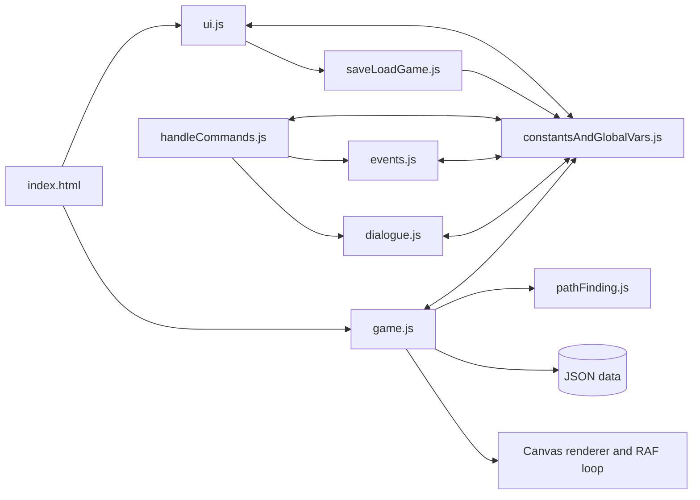

# Code and content audit

## Executive assessment

The project is a genuine playable prototype with unusually substantial authored content. Its biggest asset is not the current implementation; it is the combination of humour, locations, character art, puzzle thinking, and a working interaction loop. Its biggest constraint is that nearly every subsystem shares mutable global state. Story flow, rendering, movement, UI, dialogue, and content mutation are tightly interwoven, so small changes can create distant regressions.

The right strategy is an incremental extraction around the existing game, not a rewrite. First make state observable and testable, then separate pure rules from canvas/DOM effects, validate content, fix persistence, and modernise presentation on top of stable behaviour.

Foundation update (2026-09-13): a versioned serialisable state factory/store now provides the canonical lifecycle snapshot behind the legacy accessors. New sessions replace state, own and dispose their animation frame and session listeners, await validated data/localisation/image readiness, and fail into a visible alert. The remaining legacy modules still require the staged domain extraction described below.

Reachability update (2026-09-13): Section 4 added gated debug and test controls. Fourteen reviewed scenarios arrange canonical facts, derive every exit/entity/grid mutation from the content contract, and reach a validated state with a reproducible checksum in under a second. The always-available debug wheel was removed from the shipped page in favour of a build-gated DEBUG panel and a narrow versioned `__GAME_TEST__` API. See `debug-test-controls.md`.

### Audit accuracy review (2026-09-13)

The following statements in earlier revisions of this document were re-checked against the current source and were wrong or stale. They are corrected in place below, and the affected bug rows were updated.

| Earlier claim | Finding |
| --- | --- |
| "19 navigation records" and "`debugRoom` … points to nonexistent `libraryFoyerDebug`"; "`map` … background and grid are absent" | Stale. `resources/screenNavigation.json` now holds 18 rooms, Debug Room was intentionally removed, and the Map has art, a generated polygon grid, and reciprocal navigation. |
| "Market Street … five connections; the scene brief asked for four … needs an explicit design decision" | Stale. The contract declares `marketStreetExitCount: 5` and the validator enforces it. |
| "the current state capture/restore only persists language" | **Wrong.** `captureGameStatusForSaving()` returns the whole canonical snapshot and `restoreGameStatus()` replaces state from it, so room, position, inventory, quest facts, dialogue state, and world mutations are all persisted today. The real remaining gaps are different and are recorded against BUG-003. |
| BUG-022 recorded as resolved: "the edge-scroll named-global dependency was removed" | **Incomplete when written.** `game.js` still passed the browser-created global `canvas` to `setDynamicBackgroundWithOffset` inside `swapBackgroundOnRoomTransition`. That call now uses `getElements().canvas`; the claim is true as of this pass. |
| BUG-023: "exposed Debug option" not suitable for release | Half resolved. The debug entry now requires explicit development enablement. The placeholder product title remains open. |

## Repository snapshot

- Runtime: browser ES modules, HTML canvas, CSS, Bootstrap/jQuery/Popper and LZString from CDNs.
- Server: local Express static server, now available through `npm start`.
- Automated browser testing: Playwright with Chromium, now scaffolded by functional area.
- Content: JSON navigation, grids, objects, NPCs, localisation, and dialogue.
- World model: 18 navigation records, 42 objects, 10 NPCs, and 7 foreground room layers as validated by `npm run validate:content`. The original audit counted 19 rooms and 41 objects, before Debug Room was removed and the Map payoff object was added.
- Locales: English, Spanish, German, Italian, and French key sets are present and complete for the inspected localisation/dialogue records.
- Assets inspected: 253 PNG, 64 JPG, 5 PSD, 4 GIF, plus design documents and diagrams in the available project resources.
- Core code is roughly ten thousand physical lines, led by `game.js`, `ui.js`, `constantsAndGlobalVars.js`, `handleCommands.js`, and `events.js`.
- Repository history is currently dominated by binary material: the Git pack was approximately 906 MiB and included two tracked build ZIPs of about 49 MiB each.

Counts describe the audited snapshot and should be regenerated after large content changes.

## Runtime architecture



The diagram is simplified: several modules import one another directly, including circular relationships. `constantsAndGlobalVars.js` is effectively a service locator and mutable database with hundreds of accessors. This lets a small prototype move quickly, but makes state ownership, teardown, and isolated testing unclear.

## Startup and main loop

1. The HTML shell loads ES modules and remote UI/compression libraries.
2. Menu localisation is fetched and rendered.
3. New Game loads room/navigation/object/NPC/dialogue JSON, sets the opening room (`libraryFoyer`) and player position (grid coordinate 10,57), prepares UI/canvas listeners, and enters a `requestAnimationFrame` loop.
4. Each frame advances movement/animation, draws background and entities, and updates debug values.
5. Mouse position is translated to a grid cell. The selected verb plus hovered object/NPC/inventory item builds the interaction sentence.

There is no explicit application lifecycle with `boot`, `startSession`, `disposeSession`, and `restoreSession`; consequently repeated starts can retain state or duplicate listeners.

## Click-zone and pathfinding model

The visible canvas is mapped to an 80 × 60 logical grid. Pointer coordinates are made canvas-relative, divided by cell dimensions, and floored to select a cell.

| Cell prefix | Meaning |
| --- | --- |
| `w...` | Walkable cell/cost variant |
| `n` | Non-walkable |
| `e<number>` | Exit/hotspot mapped to a room navigation exit |
| `o<objectId>` | World object interaction footprint |
| `c<npcId>` | Character interaction footprint |

Objects and NPCs overlay rectangular footprints onto the room grid from their data dimensions. Hover identification drives command text and click handling. A* pathfinding uses grid costs and a Manhattan-style heuristic, with logic for nearby walkable fallbacks. Exits may move to target-room initial/final coordinates.

Strengths:

- A fixed logical grid decouples authored walkability from image pixels.
- Object/NPC footprints allow visual assets and interactions to be data-driven.
- Nearby-walkable fallback can keep interactions from failing when the hotspot itself is blocked.

Weaknesses:

- Rectangle-only zones are imprecise for irregular art and promote accidental overlaps.
- Resizing and CSS scaling must remain perfectly consistent with canvas coordinate mapping.
- The current *player* can still be asked to infer invisible boundaries; an optional in-game hotspot reveal mode is still needed and belongs to Section 7.

Addressed since the original audit:

- Grid codes are validated against a schema, and undeclared overlaps and out-of-bounds hotspots are validation errors rather than report-only warnings.
- `npm run report:hotspots` generates `hotspot-report.md` with bounds, anchors, accessible labels, and minimum-target-size warnings. Eight undersized legacy exits are recorded as BUG-029.
- The debug panel's overlay layer draws walkability, movement costs, blocked cells, exits, hotspots, entity footprints, anchors, the computed path, and the player cell additively over a live frame. That is a developer tool, not the player-facing reveal.

Remaining evolution: retain the grid for walking and introduce named polygon/rectangle hotspots in room data, each with its own interaction anchor and accessible label.

## Interaction and verbs

Nine classic verbs are represented: Look, Pick Up, Use, Open, Close, Push, Pull, Talk To, and Give. Two-stage verbs combine inventory/world targets. This preserves a deliberate old-school vocabulary and supports joke responses.

Section 3 replaced runtime command reconstruction with `{ verbId, primaryTargetId, secondaryTargetId }` intents. Buttons, inventory items, canvas targets, and dialogue choices carry stable IDs; translated text is presentation only. Contextual default clicks and two-target Use/Give flows are governed by pure command-state rules. The remaining legacy non-library dialogue representation is still migration debt, but it no longer participates in command identification.

## Dialogue and narrative state

The dialogue engine can display sequenced speech, options, responses, and event consequences. The inspected dialogue-flow diagram matches the code's broad cycle: enter a phase, render lines, optionally show choices, process a response/event, advance or reset the phase, and tidy UI state.

The engine is expressive but its representation obscures intent. Replace encoded control strings with a documented graph schema:

```json
{
  "id": "librarian.ask_for_help",
  "speaker": "librarian",
  "textKey": "dialogue.librarian.ask_for_help",
  "choices": [{ "textKey": "...", "next": "librarian.riddle" }],
  "actions": [{ "type": "setFlag", "id": "librarianRiddleKnown", "value": true }]
}
```

This makes choice reachability, missing translations, and quest effects statically testable. The librarian tutorial is now the first migrated graph: its lines, choices, links, and `library.learnRiddle` consequence are explicit and content-validated, with real browser traversal in all five locales. Other NPC conversations remain behind the legacy dialogue adapter and are tracked in BUG-011 for later graph migration.

## Content and data integrity

Positive findings:

- All inspected JSON parses.
- All room grids inspected are 80 × 60.
- Referenced object and NPC sprites were found.
- The five-language key sets inspected are structurally complete.

Material gaps recorded in the original audit, and their current state:

- `debugRoom` had no usable matching grid/data set and pointed to a nonexistent `libraryFoyerDebug`. **Resolved:** it was intentionally removed from shipped content, and the validator rejects its reintroduction. Its development purpose is now served by the gated debug controls.
- `map` was referenced by navigation but had no background or grid. **Resolved:** the Map now has art, a deterministic polygon walk grid, reciprocal navigation, a stable payoff object, and the `chapter1.mapReached` fact.
- Debug object/NPC JSON paths referenced by code were absent. **Resolved:** those references were removed with Debug Room.
- The runtime topology differs from the supplied world map, which contains an Embassy while the runtime adds sewer/kitchen and separate barn/house interiors. **Resolved by declaration:** `chapter1-world-v1` makes the 18-room runtime topology authoritative and labels the diagram historical.
- Market Street exposed five connections while the scene brief asked for four. **Resolved by decision:** the contract declares five and the validator enforces exactly that.

A content validator now checks IDs, files, grid dimensions/codes, reciprocal exits, spawn points, hotspot bounds, dialogue links, item references, localisation keys, and puzzle reachability. It runs as `npm run validate:content`, in CI, and at startup, where invalid shipped content fails into the visible fatal alert.

## Save and load

Corrected 2026-09-13. The original audit said capture/restore persisted language only. That has not been true since the canonical store landed: `captureGameStatusForSaving()` returns the full canonical snapshot and `restoreGameStatus()` validates and replaces state from it, so room, player position, inventory, quest facts, dialogue removals, bridge state, settings, and the mutated content bundle all round-trip through the save string.

The real remaining gaps, which still block a full chapter, are:

- **No version envelope on the player-facing path.** `saveLoadGame.js` compresses the raw state object. The versioned `{ schemaVersion, state }` envelope and migration boundary exist in `src/adapters/storage.mjs` and `src/domain/save/migrations.mjs`, but the save/load UI does not use them, so an older save cannot be migrated or clearly rejected.
- **Derived state is not rebuilt after restore.** Images, entity paths, canvas cell metrics, foreground processing, and render caches are left as they were. A restore into a running session can therefore present stale visuals.
- **The whole content bundle is inside the snapshot.** That is why world mutations survive, but it makes saves large and couples a save to the shipped content of the day. Saving stable facts and re-deriving entity/exit state, the way the debug scenarios already do, is the better shape.
- **No local Resume, autosave, or checkpoint.** The menu's Resume only restores the previous presentation mode within the session.

Section 5 owns this work: use a versioned plain state object, validate before applying, migrate older schemas, persist locally for Resume, and support explicit export/import. Save only stable facts; derive render caches and transient animations after load.

## Localisation

Five locales are a strong foundation. Section 3 removed localisation `eval`: lookup now has explicit locale/English fallback, a visible missing-key result, and interpolation restricted to supplied `${token}` names. The five-locale librarian journey proves that translated wording does not select actions or dialogue branches. Layout, text-expansion, mid-dialogue switching, and a strict CSP remain later presentation/security coverage.

## Rendering, performance, and assets

The world renderer handles backgrounds, foreground layers, sprites, movement frames, and transitions. Risks include very large source images decoded at runtime, inconsistent dimensions, and no declared asset budget. Unawaited preloading was fixed in Section 1. The worst per-frame debug work was fixed in Section 4: `updateDebugValues()` no longer serialises the whole grid every frame unless the legacy debug window is open, and frame sampling and overlays only run in a development build. Console logging in the movement, placement, and transition paths is still noisy and remains part of BUG-016.

Examples from visual and metadata inspection:

- Standard backgrounds are often 832 × 448, but audited sources also include 1530 × 765, 1000 × 581, 3329 × 1801, 1366 × 622, 800 × 436, and 800 × 600.
- Player still images mix 800 × 1500 and 200 × 375 source sizes for the same effective aspect/pose family.
- NPC images range from small legacy sprites to multi-megabyte, highly rendered caricatures.
- Several assets are byte-identical duplicates, including some player still/move frames, inventory/world items, and blank placeholders.
- A bridge-half-complete foreground is background-sized and unusually heavy relative to other sparse overlays.

Create a manifest and build-time pipeline that enforces canonical scene dimensions, character world scale, alpha/crop rules, WebP/AVIF or optimised PNG outputs, maximum decoded size, and intentional duplicate aliases.

## UI, responsiveness, and accessibility

The layout communicates the classic genre immediately, but it is heavily fixed-positioned and hard-coded. Most interaction exists only inside canvas pixels or clickable `div`/`span` elements. Keyboard navigation, screen-reader semantics, focus management, live dialogue announcements, touch sizing, reflow, reduced motion, and high-contrast treatment are absent or incomplete.

Modernisation should not simply add gloss. It should establish a scalable stage, semantic interaction mirror, consistent panels, contextual feedback, responsive layout modes, and accessible alternatives while preserving the verb-table character.

## Dependencies and delivery

- Remote CDN dependencies create offline, CSP, version-drift, and desktop-packaging risks and have no visible integrity strategy.
- The dependency audit after installation reported 34 known issues: 4 low, 3 moderate, 25 high, and 2 critical, largely in the existing packaging/server chain. Upgrade deliberately; do not apply an unreviewed force fix.
- Electron and electron-builder sit in runtime dependencies even though the root entry now serves the browser and a separate generated desktop tree exists. Choose and document one packaging architecture.
- Generated build archives were tracked despite being reproducible and large. `.gitignore` now excludes them; existing tracked archives should be removed from the index while retained locally if Leigh wants them.

## Maintainability priorities

1. Make lifecycle and state deterministic.
2. Add content validation and stable semantic schemas.
3. Complete save/load before expanding the chapter.
4. Extract commands, dialogue, puzzles, and navigation as pure/testable rules.
5. Put rendering and DOM behind adapters.
6. Establish asset/art standards and optimise delivery.
7. Modernise UI/accessibility on verified behaviour.

Detailed execution appears in the refactor, feature, testing, debug-control, and master-checklist documents.
