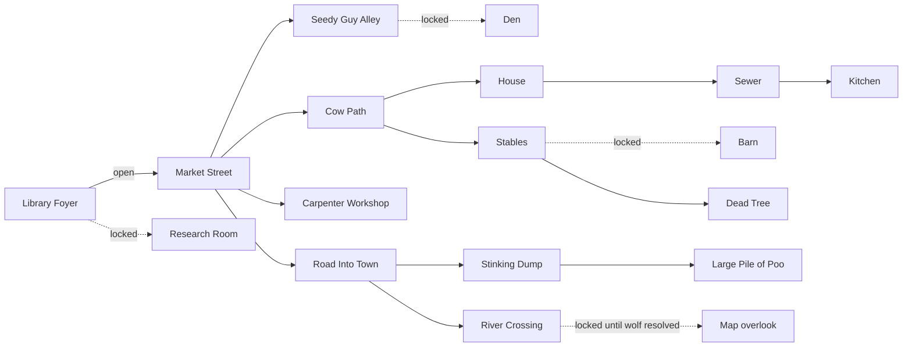
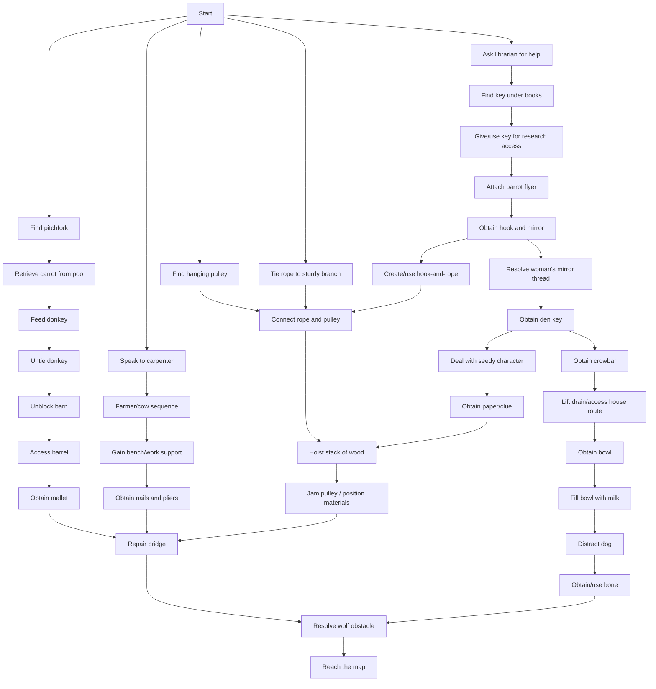

# World and puzzle model

## Sources and authority

This model reconciles the supplied world-map diagram, Chapter 1 and full puzzle-dependency diagrams, Puzzle Design Document, pulley rigging flow, and current navigation/event data. The implemented chapter1-world-v1 contract in resources/content-contract.json is authoritative. The earlier diagrams remain historical intent where they differ; see content-contract.md for the decisions and validation boundary.

## Current runtime room graph

Arrows are simplified; every canonical connection has a validated return exit. Debug Room is intentionally absent from shipped content, and the Map room now has background art, a generated walk grid, payoff interaction, and a return path.

## Design-map reconciliation

The supplied map also names Embassy, Farm Track, Large Tree, Inside Barn, and Inside House. Those names and the four-exit Market Street brief are superseded historical references. The canonical contract uses Cow Path, Dead Tree, Barn, House, Sewer, Kitchen, no Embassy, and five Market Street exits.

## Chapter 1 critical path

The dependency graph is broad but converges on repairing/crossing the river and obtaining the map. A simplified model is:

The full source diagram also connects pitchfork to glove/barrel access, hook-and-mirror to rope, cow help to a splinter/jam branch, and multiple rigging interactions. These should become named puzzle-state facts rather than implicit object mutations.

## Puzzle design assessment

Strengths:

- Dependencies cross several locations and characters, encouraging exploration.
- Chains combine dialogue, inventory, environmental change, and comedy props.
- Multiple branches converge, giving Chapter 1 a satisfying macro-structure.
- The library opening provides a smaller tutorial puzzle before the wider map.

Risks:

- The graph is large enough that one missed flag or unavailable response can soft-lock progression.
- Long dependency chains need intermediate acknowledgement and an optional journal/hint system.
- Several designed destinations/assets do not match the runnable data.
- Event logic currently mutates global object/navigation state directly, making graph reachability hard to prove.
- Item combinations and interaction anchors need clear feedback to avoid brute-force verb use.

## Implemented puzzle representation

Since Section 6 the model above is the shipped model. `resources/content-contract.json` declares **44 named actions over 56 facts**, which is the whole dependency diagram rather than a summary of it. Each action declares `id`, `chain`, `requires`, and `effects`, and each fact is represented exactly once.

The eleven facts that gate rooms or mark chapter milestones stay declared as `mandatoryFacts`, because those are what the save service checkpoints:

- `library.riddleKnown`, `library.researchKeyFound`, `library.researchRoomUnlocked`
- `research.mapClueFound`
- `den.unlocked`, `barn.unblocked`
- `rigging.assembled`, `bridge.repairMaterialsReady`, `bridge.repaired`
- `river.wolfResolved`, `chapter1.mapReached`

The other 45 facts are the detail of the chains — `parrot.mirrorObtained`, `cow.splinterRemoved`, `kitchen.milkBowlReady`, `rigging.woodHoisted` and so on. They drive the journal, the gate explanations and the soft-lock check without adding checkpoint traffic.

### How a fact gets recorded

Three routes, all data-driven:

| Route | Mechanism |
| --- | --- |
| A legacy event | `CANONICAL_ACTION_BY_EVENT` in `events.js` maps the event function to its canonical action. |
| Picking something up | `puzzle.runtimePickupActions` in the contract maps an object ID to its action. |
| A dialogue choice | A choice marked `recordsChoice` records a `choice.*` fact. |

### What is enforced, and where

- The **content validator** rejects an unreachable action, a required fact no action produces, an undeclared chain, an objective pointing at a fact that does not exist, and a pickup mapping naming an unknown action or object.
- A **unit test** walks all 44 actions from a clean start and asserts after every step that no mandatory fact has become unreachable — the chapter's no-soft-lock guarantee. No Chapter 1 action consumes a fact, so "still reachable" is exactly "still achievable".
- `criticalPathFrontier()` reports which actions are available but unfinished from any state. From a clean start it names five actions, not one, because the chapter genuinely opens five independent threads.

### Known content gap

`objectPulleyWheel` has no authored source: no placement room and no pickup, created in the world by the event that mounts it. `rigging.assemble` therefore declares only `chapter1.started` where it should declare "carrying a pulley". `pulleyRiggingFlow.txt` records "3 more objects to make", so this is unfinished authoring, tracked as BUG-035.

## Authoring rules

- Every required clue must remain available until its puzzle is solved.
- Every irreversible action needs an explicit design review; default actions should be idempotent.
- All gates must expose a player-readable reason through Look/Talk feedback.
- Every puzzle milestone needs a stable ID, telemetry/debug visibility, and at least one unit or E2E assertion.
- Alternate solutions should converge on the same canonical fact rather than duplicate downstream logic.
- Room exits and puzzle gates must be validated against both navigation and quest state.
