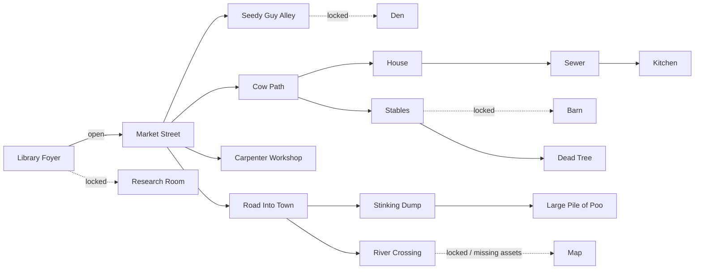
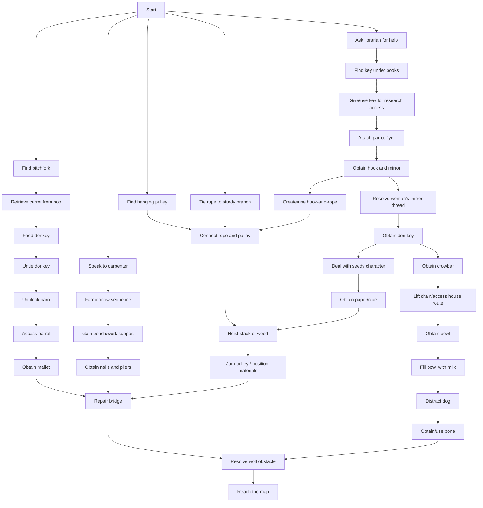

# World and puzzle model

## Sources and authority

This model reconciles the supplied world-map diagram, Chapter 1 and full puzzle-dependency diagrams, Puzzle Design Document, pulley rigging flow, and current navigation/event data. The diagrams describe intent; the runtime data describes what exists today. Differences are recorded rather than silently resolved.

## Current runtime room graph

Arrows are simplified; most implemented connections have a return exit. `debugRoom` is excluded because its content/exit target is broken.

## Design-map reconciliation

The supplied map also names Embassy, Farm Track, Large Tree, Inside Barn, and Inside House. Runtime naming/topology uses Cow Path, Dead Tree, Barn, House, Sewer, and Kitchen, and has no Embassy. Decide which diagram/data version is canonical, then version the other as historical reference. Market Street's brief specifies four exits whereas runtime data contains five.

## Chapter 1 critical path

The dependency graph is broad but converges on repairing/crossing the river and obtaining the map. A simplified model is:

The full source diagram also connects pitchfork to glove/barrel access, hook-and-mirror to rope, cow help to a splinter/jam branch, and multiple rigging interactions. These should become named puzzle-state facts rather than implicit object mutations.

## Puzzle design assessment

Strengths:

- Dependencies cross several locations and characters, encouraging exploration.
- Chains combine dialogue, inventory, environmental change, and comedy props.
- Multiple branches converge, giving Chapter 1 a satisfying macro-structure.
- The library opening provides a smaller tutorial puzzle before the wider map.

Risks:

- The graph is large enough that one missed flag or unavailable response can soft-lock progression.
- Long dependency chains need intermediate acknowledgement and an optional journal/hint system.
- Several designed destinations/assets do not match the runnable data.
- Event logic currently mutates global object/navigation state directly, making graph reachability hard to prove.
- Item combinations and interaction anchors need clear feedback to avoid brute-force verb use.

## Target puzzle representation

Represent each fact once in a quest-state store, for example:

- `library.riddleKnown`
- `library.researchRoomUnlocked`
- `den.unlocked`
- `barn.unblocked`
- `rigging.assembled`
- `bridge.repairMaterialsReady`
- `bridge.repaired`
- `river.wolfResolved`
- `chapter1.mapReached`

Each event declares prerequisites, effects, presentation, and idempotency. A validator can then determine unreachable facts and tests can create a state through public debug commands without replaying hours of prerequisites.

## Authoring rules

- Every required clue must remain available until its puzzle is solved.
- Every irreversible action needs an explicit design review; default actions should be idempotent.
- All gates must expose a player-readable reason through Look/Talk feedback.
- Every puzzle milestone needs a stable ID, telemetry/debug visibility, and at least one unit or E2E assertion.
- Alternate solutions should converge on the same canonical fact rather than duplicate downstream logic.
- Room exits and puzzle gates must be validated against both navigation and quest state.
